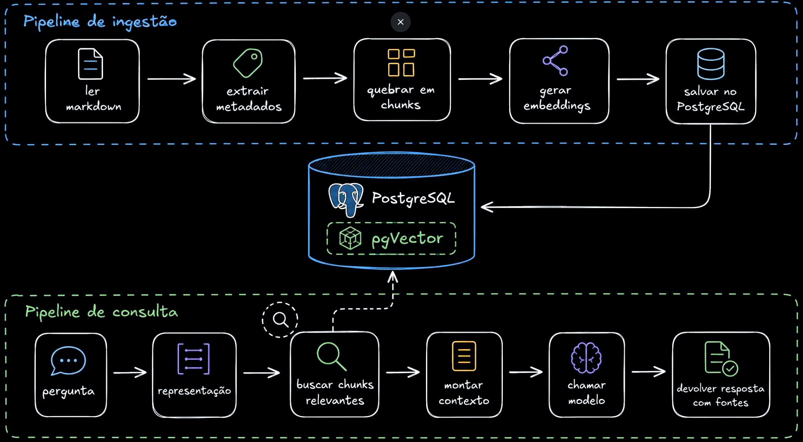

# RAG - 
- Retrieval:  Busca e recupera informações relevantes de fontes externas
- Augmented:  Enriquece o prompt com o contexto recuperado
- Generation: O modelo gera resposta com base no prompt aumentado

## definição
- é um pipeline que conecta o sistema ao conhecimento externo, não uma feature.
- é uma arquitetura de recuperação de contexto.

## o que nao é/faz o rag?
- não é banco de dados vetorial com LLM.
- rag nunca é a fonte da verdade.
- rag não executa ações.
- ele não concerta dados ruins ou desatualizados.
- rag não trabalha com autorização e permissão de acesso, isso deve ser tratado na arquitetura do sistema.
- rag não é grátis.
- rag não é bala de prata; muitas vezes uma query é melhor, outras vezes uma chamada em API é melhor.

## quando não usar
- quando a informação esta num banco de dados ou numa API.
- quando preciso executar alguma ação.
- quando sabemos de forma as respostas de óbvia
- quando são perguntas repetitivas como FAQ.

## quando usar
- quando as informações estão em fontes nao extruturadas e as consultas não são deterministicas.

## boas práticas e detalhes
- llm nunca deve executar operações que estiverem dentro dos parametros [human] ou semelhantes.
- funciona muito bem com cache, porém um não elimina o outro.
- rag parece fácil mas ter a resposta realmente correta não é tão simples.
- somente indexar não é rag pronto.
 - faça o retrieval corretamente pois a resposta sempre será enviada para o usuário, mesmo que esteja errada.
- defina um limite minimo de similaridade, senão o chunk mais próximo será retornado e ainda assim será a resposta errada.
- não é o modelo/llm que gera resposta errada, seu retrieval que pode estar errado ou você esta jogando o contexto para o modelo de forma errada (mesmo que o retrieval esteja correto).
- o modelo gera a resposta, mas o retrieval escolhe a evidência.
- uma recusa correta é melhor que uma resposta incorreta.
- normalize a pergunta do usuário baseado na intenção dele antes de enviar para o retrieve. (como um query planner)

## ver depois
    - ver um pouco mais sobre rerank
        o sistema manda os 4 melhores chunks para o modelo escolher?!

## fluxo

