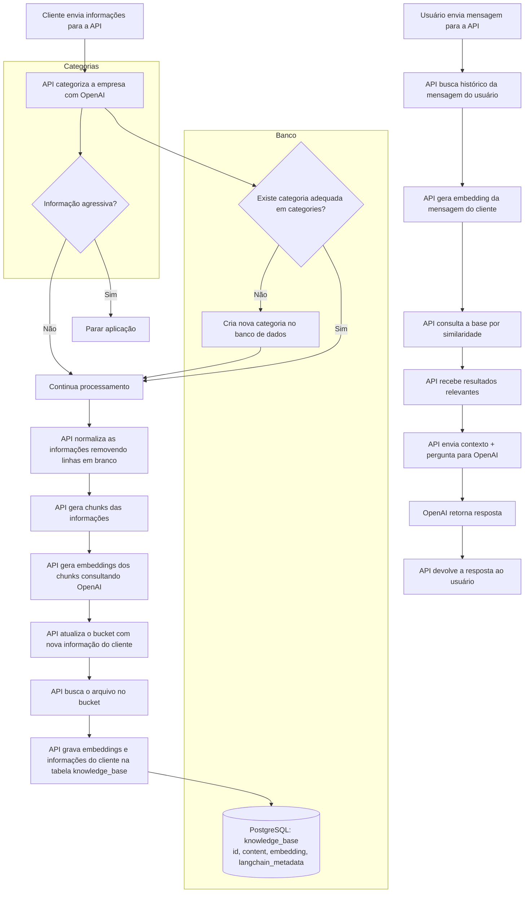

# Fluxo do sistema (Mermaid)

```mermaid
flowchart TD
    A[Cliente envia informações para a API] --> B[API categoriza a empresa com OpenAI]
    B --> C{Existe categoria adequada em categories?}
    C -- Sim --> D[Continua processamento]
    C -- Não --> E[Cria nova categoria no banco de dados]
    E --> D

    D --> F[API normaliza as informações removendo linhas em branco]
    F --> G[API gera chunks das informações]
    G --> H[API gera embeddings dos chunks consultando OpenAI]
    H --> I[API atualiza o bucket com nova informação do cliente]
    I --> J[API busca o arquivo no bucket]
    J --> K[API grava embeddings e informações do cliente na tabela knowledge_base]
    K --> L[(PostgreSQL: knowledge_base\nid, content, embedding, langchain_metadata)]

    M[Usuário envia mensagem para a API] --> N[API busca histórico da mensagem do usuário]
    N --> O[API gera embedding da mensagem do cliente]
    O --> P[API consulta a base por similaridade]
    P --> Q[API recebe resultados relevantes]
    Q --> R[API envia contexto + pergunta para OpenAI]
    R --> S[OpenAI retorna resposta]
    S --> T[API devolve a resposta ao usuário]

    B --> X{Informação agressiva?}
    X -- Sim --> Y[Parar aplicação]
    X -- Não --> D

    subgraph Banco
        C
        E
        L
    end

    subgraph Categorias
        B
        X
    end
```
